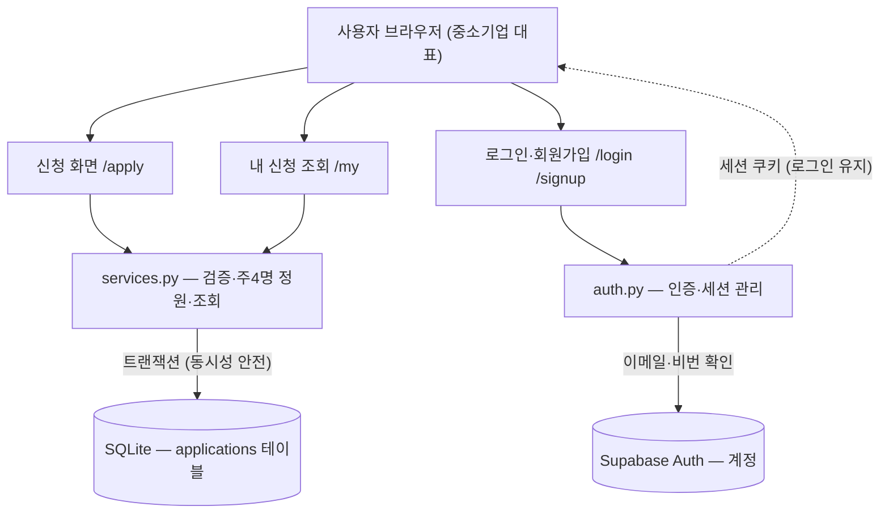

# 서비스 구조 흐름도 (Architecture)

이 서비스가 **어떻게 동작하는지**를 4개 계층으로 정리한 문서입니다.
거의 모든 웹서비스가 이 틀(화면 → 라우트 → 로직 → 데이터)을 따릅니다.

## 전체 흐름도

## 4계층으로 읽는 법 (위 → 아래)

1. **화면 (사용자 브라우저)** — 사람이 보고 누르는 곳. "무엇을 할 수 있나"의 입구.
2. **라우트 (FastAPI, `app/main.py`)** — 각 URL이 어떤 요청을 받을지 정하는 교통정리. `/apply`, `/my`, `/login` 등.
3. **로직 (`app/services.py`, `app/auth.py`)** — 실제 규칙이 사는 곳. 정원 4명 확인, 중복 차단, 로그인 검증. 화면·DB와 분리하는 게 핵심.
4. **데이터 (SQLite, Supabase)** — 최종 저장·조회. 신청은 SQLite, 계정은 Supabase(하이브리드).

## 흐름을 문장으로 (두 갈래)

- **신청**: 브라우저 `/apply` → `services.py`(검증 → 트랜잭션으로 주 4명 정원 확인) → `SQLite` 저장
- **로그인 후 내 신청**: 브라우저 `/login` → `auth.py` → `Supabase`(비번 확인) → 세션 쿠키 발급 → `/my` → `services.py`(검증된 이메일로 조회) → `SQLite`

## 왜 이렇게 나누나 (설계 감각)

- 새 기능을 넣을 때 **"이건 어느 층 일이지?"** 만 물으면 된다.
  - 예: "상담 희망시간 받기" → 화면(입력칸) + 로직(저장 함수) + 데이터(컬럼 1개).
- **로직을 화면·DB와 분리**하면, 화면을 바꿔도 규칙은 그대로고, DB를 SQLite→PostgreSQL로 바꿔도 화면은 안 건드린다.
  - "인증만 Supabase" 하이브리드가 쉬웠던 이유가 이 분리 덕분.

## 관련 파일

| 계층 | 파일 |
|------|------|
| 라우트 | `app/main.py` |
| 로직 | `app/services.py`, `app/auth.py` |
| 데이터/설정 | `app/db.py`, `app/config.py` |
| 화면 | `app/templates/`, `app/static/style.css` |
